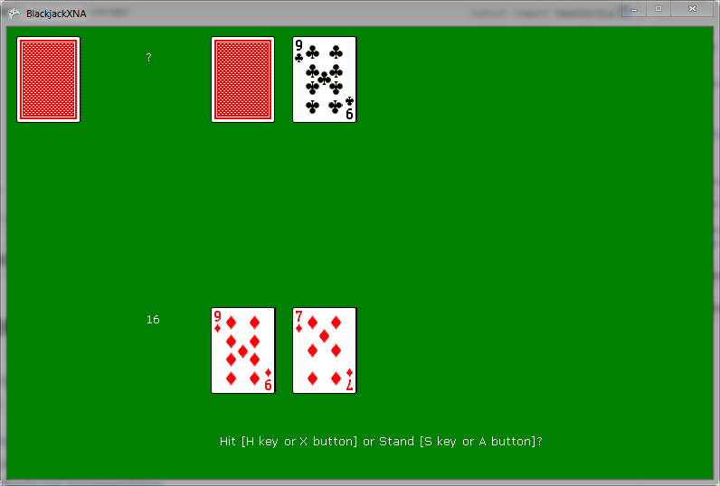

### Blackjack
> Blackjack implementations in Lua ([Love2D](https://github.com/stpettersens/21/tree/master/love)), C# ([XNA](https://github.com/stpettersens/21/tree/master/xna) & [Unity](https://github.com/stpettersens/21/tree/master/unity/BlackjackUnity)) and HTML5 
> (JavaScript, [TypeScript](https://github.com/stpettersens/21/tree/master/html5/typescript), [CoffeeScript](https://github.com/stpettersens/21/tree/master/html5/coffeescript) & [Dart](https://github.com/stpettersens/21/tree/master/html5/dart)).

* [Play the HTML5/JavaScript implementation here](http://stpettersens.github.io/21)
* [TypeScript implementation](http://stpettersens.github.io/21/typescript)
* [CoffeeScript implementation](http://stpettersens.github.io/21/coffeescript)
* [Dart implementation](http://stpettersens.github.io/21/dart) (requires [browser with Dart VM](https://www.dartlang.org/tools/dartium/)).
* [Enchant.js implementation](http://stpettersens.github.io/21/enchant_js)

